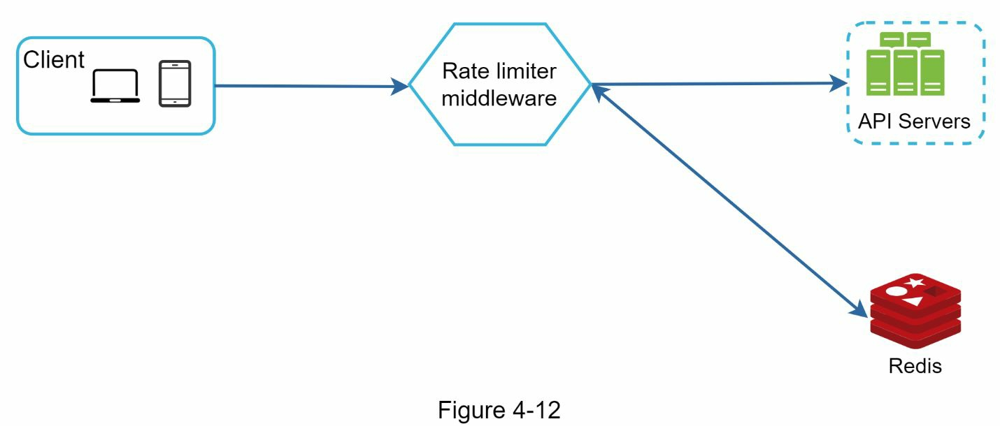
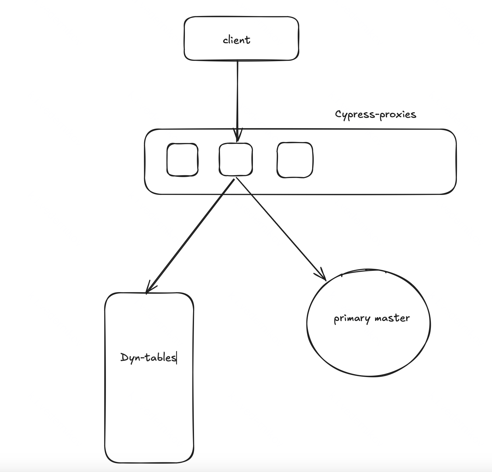

# Рейт лимитер

В современных распределённых системах важно обеспечивать стабильность и предсказуемость работы сервисов, особенно при высокой нагрузке. Одним из ключевых механизмов защиты от перегрузки является рейт-лимитер — компонент, ограничивающий количество запросов, выполняемых за определённый промежуток времени.

Рейт-лимитирование помогает:

- предотвращать перегрузку сервисов, защищая их от чрезмерного количества запросов,
- обеспечивать равномерное распределение нагрузки,
- снижать риск DDoS-атак и злоупотреблений,
- управлять доступом к API и платным ресурсам.

В облачных средах рейт-лимитеры особенно важны, поскольку ресурсы выделяются динамически и часто распределяются между множеством пользователей. В отличие от bare metal, где система владеет фиксированным набором аппаратных ресурсов, облачные решения работают на виртуализированных мощностях, где вычислительные ресурсы (CPU, память, сеть) могут быть разделены между разными клиентами и сервисами.

Основные причины, по которым рейт-лимитирование особенно актуально в облаке:

- Автоматическое масштабирование: перегрузка одной части системы может вызвать каскадное создание новых экземпляров, увеличивая расходы.
- Ограниченные ресурсы: облачные провайдеры устанавливают жёсткие лимиты на использование CPU, сети и диска, и превышение этих лимитов может привести к деградации производительности или дополнительным затратам.
 - Изоляция пользователей: в облаке важно предотвращать ситуацию, когда один клиент (или часть системы) монополизирует ресурсы, ухудшая качество обслуживания для других.
 - Стоимость: без ограничений на количество запросов сервис может генерировать чрезмерные затраты, особенно при использовании платных API или серверов с авто-масштабированием.

В этом документе рассматриваются основные требования к рейт-лимитеру, варианты его реализации и их особенности.

## Требования к системе

Во-первых будем считать, что для каждого пользователя существует отдельные лимиты (например васе можно 10 запросов в секунду потому что он купил премиум, а пете можно 5). Это вполне частый сценарий - например в конце мы рассмотрим дизайн распределенных троттлеров в такой системе как YT и там будут такие требования

Во-вторых будем считать, что у нас есть какие-то общие лимиты на запросы в систему. 

Заметим, что первого требования может и не быть или у него может быть очевидное решение - просто реализовать логику троттлинга на строне клиента. Тут все зависит от нашего основного приложения. Если наш основной сервис имеет какое-то публичное API, к которому приходит случайный человек, то такое простое решение мы не сможем сделать и нам придется троттлить каждого пользователя уже на нашем rate-limit-ере. Кроме того, бывает случаи, когда лимиты могут меняться динамически у отдельного пользователя, в таком случае реализовать эту логику на клиенте тоже не получится, потому что придется периодически бродкастить обновления лимитов, что может быть дорого.

Кроме того, стоит учесть случай DDoS-атаки. В таком случае мы хотим сделать некоторый детектор и поэтому троттлинг отдельных лиц на нашем сервисе нам также может быть интересен, чтобы просто банить таких людей и не смешивать их запросы с общей толпой. 

## Архитектура

Понятно, что простым счетчиком в этой задаче не обойдешься - его необходимо декрементить в какие-то моменты времени, поэтому мы будем хранить очереди событий. Для каждого пользователя будет отдельная очередь - там мы просто будем хранить timestamp-ы обращений. Также нам необходимо хранить собственно сами лимиты. Если пользователь понимает, что очередь заполнена до конца, то он смотрит первый элемент в очереди и засыпает на нужное время для удаления элемента

Когда пользователь приходит с запросом, то мы подчищаем очередь, а затем кладем наш timestamp. То есть для "редких" пользователей число чтений будет относится к числу мутаций как 2:1 (1 раз пишем в очередь, 1 раз читаем размер очереди и 1 раз читаем лимит), для "частых" пользователей число это отношение также сохраняется (прочитать лимиты, прочитать первый элемент очереди, удалить, записать свой). Возможно где-то надо +-1 запрос, но суть та же - число записей очень близко к числу чтений. 

Итого, для сервиса нужна БД, которая умеет:

1) поддерживать KV-хранилища
2) поддерживать очереди

Кроме того, нам не нужно поддерживать абсолютно точное число записей в очереди, то есть семантика exactly-once нам ни к чему во втором пункте. На самом деле это упрощает задачу, ведь есть системы, которые могут не обеспечивать exactly-once в некоторых инсталляциях. Например есть блог, в котором тестировали c помощью jepsen Redis и RabbitMq на exactly-once и показали, что они могут не давать такой гарантии - вот ссылка https://aphyr.com/posts/283-jepsen-redis

Рассмотрим системы, на которых мы можем хранить такие данные (чем раньше рассмотрена система, тем лучше ее использовать):

1) Redis. Тут вроде как все подходит - есть KV-хранилище, есть очереди, есть TTL (последнее не критично, но неплохо - можно для редких пользователей сделать самоочищение). Кроме того, база in-memory, а значит будет работать быстрее, чем следующие базы. Кроме того, в Яндекс Облаке есть managed service for valkey.

2) Postgres. Тут все сложнее. Во-первых база не in-memory, а значит будет работать медленнее, чем Redis. Во-вторых для KV-хранилища и очередей скорее всего придется использовать индексы в виде B-деревьев, которые часто будут перестраиваться (из-за частых записей), что не очень быстро.

Также в теории можно использовать RabbitMq или Kafkу, но они не поддерживают kv-интерфейс, а в кафке еще и нельзя сразу много топиков создавать, так что хрен с ними

Итоговая архитектура будет выглядеть так

Быстрая бд это хорошо, но неплохо было бы иметь кэши, чтоб постоянно не ходить по сети в редис (ну или ходить не сразу). Caas нам не подойдут, потому что это не быстрее, чем обычный редис - нам нужно придумать локальные кэши. Например можно использовать локальную ограниченную очередь с сообщениями (например хранить последние k запросов). Ну и поддерживать для каждого пользователя отдельную очередь, в которой будут только сообщения из этой единой очереди. Если уже в такой очереди человечку стоит подождать, то пусть ждет или мы абортим запрос. Можно также воспользоваться memcached из яндекс облака - можно развернуть его на виртуалке.

Наш сервис вполне может быть распределенным и в таком случае мы захотим локализовать данные. Во-первых, если у нас поднято несколько инстансов сервиса, то можно использовать consistent-hashing. В таком случае запросы от одного пользователя будут идти на один инстанс сервиса и мы не будем хранить данные пользователя на разных инстансах.

Бывают также сервисы, у которых мы ничего не знаем про клиента отдельно. В таком случае можно воспринимать нашу задачу как сделать Rate Limiter на IP. Можно также ввести отдельные очень маленькие ограничения на таких анонимных пользователей. Но все это не до конца защищает сервис от таких анонимных пользователей - они могут нас просто попытаться задудосить, в таком случае их можно сразу банить (построить такой простой детектор - задача на АА, я не буду ее тут описывать) + можно просто воспользоваться CAPTCHA.

## Архитектура похожего в YT

Автор имел дело с похожим в мастер-сервисе YT, так что опишу нетипичное (по крайней мере не подходящее под то, что выше) решение данной задачи там

### Немного контекста для понимания системы

Мастер сервер YT это сервис, который хранит в себе метаданные о пользователях, нодах и проч (например ACL, те же лимиты и многое другое). На данный момент мастер-сервер - это шардированная система - она состоит из одного primary-master-а (на самом деле это RSM) и нескольих RSM-secondary-master-ов.

Сейчас мастер сервер находится в состоянии переезда на новую схему, которая называется sequoia. В ней останутся только primary master, а вторичные мастера переедут в динтаблицы (думаю читатель знает что это, но если нет, то это просто KV-хранилища). В систему также добавятся cypress-proxies, которые будут новой точкой входа (раньше это был первичный мастер). После cypress-proxies запросы будут переходить либо на первичного мастера, либо на вторичные, которые лежат в динатаблицах - в зависимости от пути ноды, в которую они идут. Общая система выглядит как на картинке (важно - проксей несколько)

### Требования к троттлерам

Теперь троттлинг переезжает с первичного мастера на cypress-proxies. Кроме того, YT поддерживает лимиты для каждого пользователя. Эти лимиты храняться на первичном мастере. Лимиты могут периодически обновляться. Кроме того, пользователи идут к случайной проксе, поэтому необходимо поддерживать не преодоление пользователем общего лимита

### Описания решения

1. Как cypress-proxies узнают о лимитах

На самом деле тут все просто, первичный мастер периодически делает бродкаст на прокси и передает им дифф лимитов.

2. Как поддерживать общий баланс для пользователя на всех проксях.

Среди проксей выбирается мастер. Роль мастера в этой системе - пересчитывать лимиты и назначать на каждую проксю новые лимиты для каждого пользователя. Периодически прокси должны отчитываться мастеру о том, сколько запросов сделал к нему пользователь каждый пользователь (чтобы не передавать много данных это делается в инкрементальном виде). Мастер на основе этих отчетов пересчитывает лимиты (тут есть несколько стратегий - можно равномерно, можно пропорционально нагрузке на проксю) и скидывает обновления на прокси.

